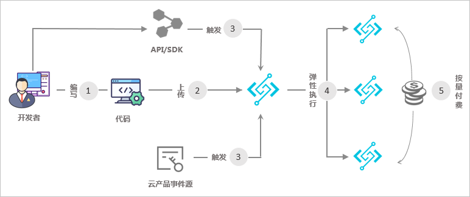
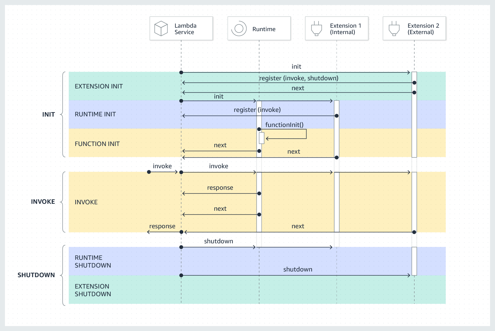

# BingoInsightFunction函数服务

## 什么是函数

函数是管理、运行的基本单元，通常由一系列配置与一系列可运行代码/软件包组成。

## 什么是函数服务

利用函数服务，您可以运行函数以处理各种事件、业务和预测。您可以通过使用函数服务的 API 或使用BingoInsightEvent事件服务发送事件来调用函数。

## 事件和触发器

触发器在触发函数时会将事件传递给函数。事件在传递时以一个特定的数据结构体现，数据结构格式在传递时均为 JSON 格式，并以函数 event 入参的方式传递给云函数。

  

>触发事件的 JSON 数据内容，在不同的语言环境下将会转换为各自语言的数据结构或对象，无需在代码中自行进行从 JSON 结构到数据结构的转换。
>例如，在 Python 环境中，JSON 数据内容会转变为一个复杂 dict 对象，即函数的入参 event 就是一个 Python 的复杂 dict 对象。而在 Golang 或 Java 中，入参是一个需要和 event 数据结构可以匹配的对象。

``` python
def run(event, context):
    return f'{event['data']}'
```

### 调用类型

默认所有函数都支持异步调用，同步调用则必须在部署的时候选择部署服务。调用的时候必须带上`invokeType`参数来区分是同步调用还是异步调用。

1. 同步调用 - 同步调用函数将会在调用请求发出后持续等待函数的执行结果返回。
2. 异步调用 - 异步调用将不会等待结果返回，只发出请求并获得当前请求的 Request ID

### 触发方式

函数的触发方式通常有3种：

1. 应用通过HTTP接口的API进行调用触发
2. 通过BingoInsightEvent事件服务的事件触发
3. 通过BingoInsightFlow数据流服务进行定时调度

### 场景例子

1. 上传图片后，触发成功上传事件，事件服务调用缩略图处理函数生成缩略图
2. 数据资源数据发生变化，触发变化事件，事件服务调用数据处理函数
3. 数据流服务定时调度到达指定事件，触发调用函数
4. 第三方应用通过API接口调用函数服务

## 运行时（Runtime）

运行时是通过操作系统、编程语言和软件库的组合构建的。函数服务通过使用运行时支持多种语言和框架。您可以在创建函数时选择运行时，并且可以通过更新函数的配置来更改运行时。底层执行环境提供了您可通过函数代码访问的额外的依赖库、环境变量。

> 运行时通常包含一个程序包，在调用函数之前，会初始化运行时，并执行运行时程序包，也可以使用docker把运行环境、依赖库和程序包打包成镜像。

  

### 运行时的工作

- **获取设置** – 读取环境变量以获取有关函数和环境的详细信息。
  - DAAS_FUNCTION_TASK_HANDLE – 处理程序的位置（来自函数的配置）。标准格式为 file.method，其中 file 是没有表达式的文件的名称，method 是在文件中定义的方法或函数的名称。
  - DAAS_FUNCTION_TASK_ROOT – 包含函数代码的目录。
- **初始化函数** – 加载函数文件并运行它包含的任何全局或静态代码。函数应该创建静态资源一次，然后将它们重复用于多个调用。
- **调用函数处理程序** - 将事件和上下文对象传递给函数。
- **处理错误** – 如果出现错误，请调用初始化错误 API 并立即退出。
- **处理日志** - 把运行日志输出到对应日志文件或日志服务。

### 运行时初始化

开始于执行 init 引导程序文件，开发者可以根据需要在 init 中自定义实现个性化操作，直接处理或调用其他可执行程序文件来完成初始化操作。以下是在初始化阶段完成的基础操作：

- 设定运行时依赖库的路径及环境变量等。
- 加载自定义语言及版本依赖的库文件及扩展程序等，如仍有依赖文件需要实时拉取，可下载至 /tmp 目录。
- 创建上下文对象
解析函数文件，并执行函数调用前所需的全局操作或初始化程序（如开发工具包客户端 HTTP CLIENT 等初始化、数据库连接池创建等），便于调用阶段复用。
启动安全、监控等插件。
初始化阶段完成后，需要主动调用运行时 API，访问初始化就绪接口 /runtime/init/ready 通知 SCF，Custom Runtime 运行时已完成初始化，进入就绪状态，否则 SCF 会持续等待，直到达到配置的初始化超时时间后，结束 Custom Runtime 并返回初始化超时错误。若重复通知，则会以首次访问时间作为就绪状态时间结点。

## 运行时环境变量（Environment Variables）

运行时环境变量是与某个函数一起部署的键值对。这些变量仅与该函数相关联，因此它们对您系统中的其他函数不可见。

- 您可以界面或API进行添加或移除运行时环境变量。
- 您可以使用环境变量来调整函数的行为，而无需更新代码。

> 环境变量不会在调用函数之前计算。您定义的任何值都将被视为文字字符串，且不会被展开。在函数代码中执行变量计算。

要在函数代码中的环境变量，请使用编程语言的标准方法。

``` python
import os
env_str = os.environ['MY_ENV_STRING']
```

``` java
String envStr = System.getenv("MY_ENV_STRING");
```

### 使用场景

1. 可变值提取：针对业务中有可能会变动的值，提取至环境变量中，可避免需要根据业务变更而修改代码。
2. 加密信息外置：认证、加密相关的 key，从代码中提取至环境变量，可避免相关 key 硬编码在代码中而引起的安全风险。
3. 环境区分：针对不同开发阶段所要进行的配置和数据库信息，可提取到环境变量中。针对开发和发布的不同阶段，仅需要修改环境变量的值，分别执行开发环境数据库和发布环境数据库即可。

### 使用限制

针对函数的环境变量，有如下使用限制：

1. key 必须以字母 [a-zA-Z] 开头，只能包含字母数字字符和下划线（[a-zA-Z0-9_]）。
2. 预留的环境变量 key 无法配置。预留的 key 包括：
   1. DAAS_开头的 key，例如 DAAS_FUNCTION_ENVIRONMENT。
   2. 运行时本身在使用的 key，例如 PYTHONPATH。

### 预留环境变量

|环境变量|描述|
|---|---|
|DAAS_FUNCTION_ENVIRONMENT| 可以将 **DAAS_FUNCTION_ENVIRONMENT** 设置为：Development 和 Production。 如果未设置 **DAAS_FUNCTION_ENVIRONMENT**，则在本地环境中默认为 Development，在 部署环境 中默认为 Production。
|DAAS_FUNCTION_NAME| 函数名称|
|DAAS_FUNCTION_VERSION| 函数版本|
|DAAS_FUNCTION_TASK_ROOT | 函数代码的路径|
|DAAS_FUNCTION_TASK_HANDLE | 处理程序的位置（来自函数的配置）。标准格式为 file.method，其中 file 是没有表达式的文件的名称，method 是在文件中定义的方法或函数的名称。|

### 环境变量安全

- 只有函数的拥有者才能查看或管理函数上的环境变量。
- 您还可以选择存储环境变量时对其进行加密，并在函数代码中对其解密。这样环境变量在传输中和设置中都会已加密的方式存在。在您的代码中，您可以从环境中读取加密的值并使用对其进行解密。 `暂不实现`

## 函数上下文（Context）

``` python
function_name - 函数名称
function_version - 函数版本号
runtime - 函数运行时
request_id - 请求ID
user_id - 用户ID
tenant_id - 租户ID
app_id - 应用ID
```

``` python
def run(event, context):
    return f'{context.request_id}'
```

## 日志记录

可在函数中通过 logging 库输出日志到日志服务，并允许标记在函数执行期间遇到的警告和错误。

``` python
import logging
logger = logging.getLogger()

def run(event, context):
    logger.info('Python HTTP trigger function processed a request.')
```

## 多个函数

- 每个部署的函数都与其他所有函数（甚至是从同一个源文件部署的函数）隔离。具体来说，这些函数不会共享内存、全局变量、文件系统或其他状态。 `暂不实现`
- 多个函数的编排可以通过BingoInsightFlow数据流服务来进行函数编排

## 注意事项

- 代码文件在打包时候，计算hash值并保存起来，在使用代码时下载代码包并执行完整性检查。
