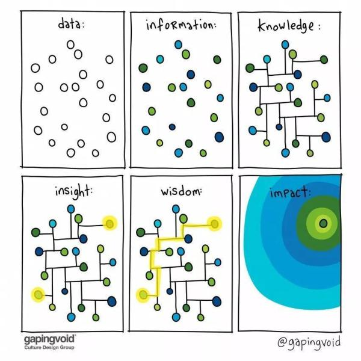
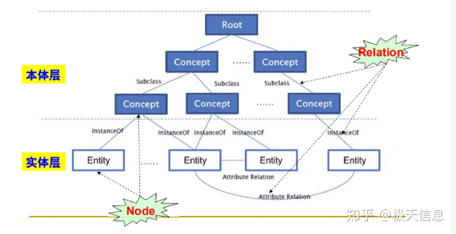
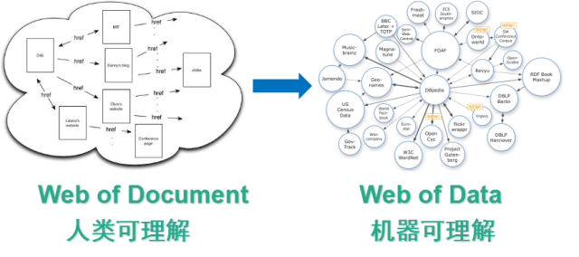
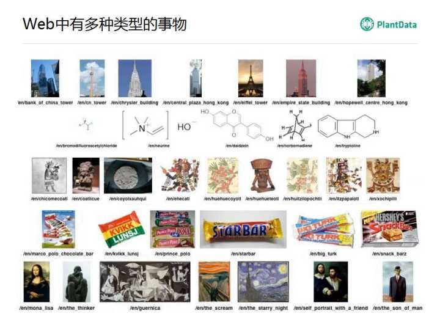
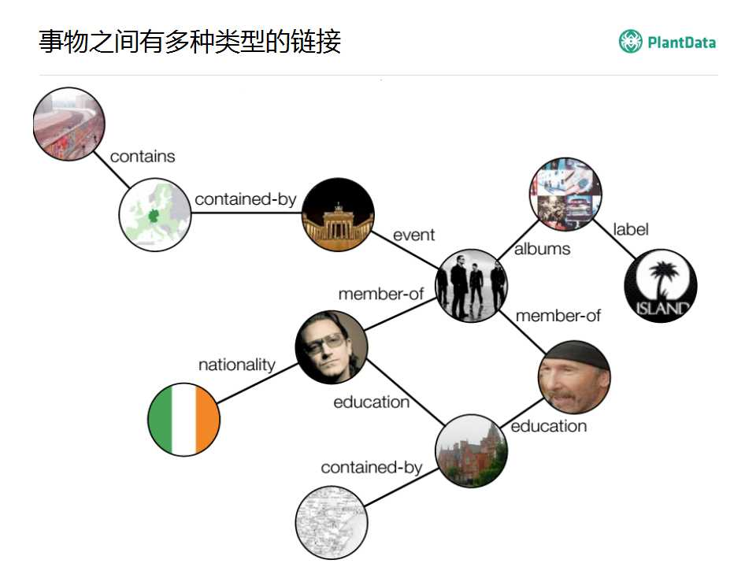
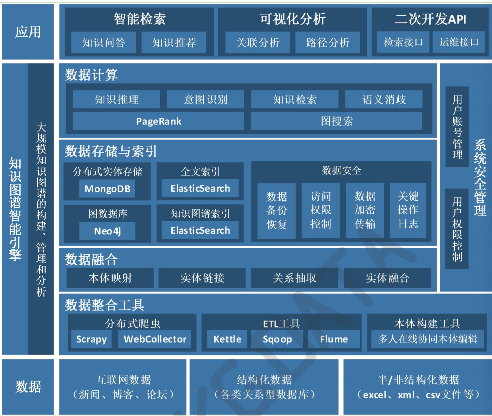
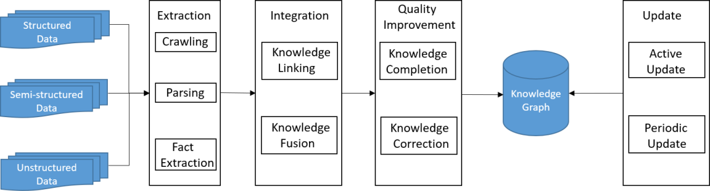

# 知识图谱概述

  

## 什么是知识

柏拉图认为：Knowledge is justified ,true beliefs

具体可以理解为，知识需要具备以下三点：

- 验证过的
- 正确的
- 而且是被人们相信的

数据：我们收集数据，但是如果我们只是把数据放在那，不做整理，不做思考，那么它们就只是一个个单色的小圆圈。

信息：我们按照各种各样的结构和维度来为这些数据分类，这样我们在需要时，能够很快的检索到这些数据——这些数据现在为我们的需求服务，它们有了“信息”价值，所以，它们现在变成彩色的了。

知识：当所有的信息彼此间都有了关联，我们就能根据某一个信息点得到与之相关的看法，并且这些看法不再受到原有信息的局限，这就是所谓的举一反三，这就是我们的知识图谱。

洞察力：由于这些看法是基于“数据－信息－知识”的路径所产生的，这比传统的经验更具有合理性和可靠性，基于这些“知识”所做的决策可以称之为“洞察力”。

智慧：当我们对事物的看法来源于大量信息点所构成的知识网，我们就可以以此来构建解决问题的路径，比如从A端到B端的路径——这太像CRM中的销售过程了。

作用力：随着数据的累积，信息的集成，知识的构建，洞察力的形成以及过程管理的智能化，在企业内部形成的凝聚力将最终体现为巨大的外部作用力和影响力。

第一，什么是数据？

我们经常说“ 水的温度是100℃，礼物的重量是500克，木头的长度是2米，大楼的高度100层“。通过水，温度，100℃，礼物，重量，500克，木头，长度，2米，大楼，高度，100层这些关键词,我们的大脑里就形成了对客观世界的印象。这些约定俗成的字符或关键词就构成了我们探讨的数据基础，我们提到关键词必须是人们约定俗成的。这就表示不同阶级，不同宗教。不同国家的人对于关键词的约定必然会有差异。由此我们可以推导出数据其实也具有一个使用范围。不同领域的人在描述同一事物会出现不同的数据。例如，中国人会称每个星期的最后一天为”星期天“。美国人会把这一天叫做“Sunday”。基督教徒会称这一天为“礼拜天”. 数据的有范围性导致由此建立的信息世界，知识世界在不同的国家。不同的宗教，不同的阶级中会产生差异。认识到数据的有范围性可以帮助我们在一个领域进行知识管理时，首先要统一关键词或数据的约定。

最后我们对数据进行这样的定义：数据是使用约定俗成的关键词，对客观事物的数量、属性、位置及其相互关系进行抽象表示，以适合在这个领域中用人工或自然的方式进行保存、传递和处理。

第二，什么是信息？

作为知识层次中的中间层，有一点可以确认，那就是信息必然来源于数据并高于数据。我们知道象7度，50米，300吨，大楼，桥梁这些数据是没有联系的，孤立的。只有当这些数据用来描述一个客观事物和客观事物的关系，形成有逻辑的数据流，他们才能被称为信息。除此之外，信息事实上还包括有一个非常重要的特性— 时效性。例如新闻说北京气温9摄氏度，这个信息对我们是无意义的，它必须加上今天或明天北京气温9摄氏度。再例如通告说，在会议室三楼开会，这个信息也是无意义的，他必须告诉我们是哪天的几点钟在会议室三楼开会。

注意信息的时效性对于我们使用和传递信息有重要的意义。它提醒我们失去信息的时效性，信息就不是完整的信息，甚至会变成毫无意义的数据流。所以我们认为信息是具有时效性的有一定含义的，有逻辑的、经过加工处理的、对决策有价值的数据流。

第三，什么是知识？

信息虽给出了数据中一些有一定意义的东西，但它的价值往往会在时间效用失效后开始衰减，只有通过人们的参与对信息进行归纳，演绎，比较等手段进行挖掘，使其有价值的部分沉淀下来，并于已存在的人类知识体系相结合，这部分有价值的信息就转变成知识。例如。北京7月1日，气温为30度。在12月1日气温为3度。这些信息一般会在时效性消失后，变得没有价值，但当人们对这些信息进行归纳和对比就会发现北京每年的7月气温会比较高，12月气温比较低，于是总结出一年有春夏秋冬四个季节，因此我们认为知识就是沉淀并与已有人类知识库进行结构化的有价值信息。

把有关信息关联起来的在一起所形成的信息结构称为知识，知识是人类对信息提炼和总结的结果。知识是人们在改造客观世界的实践中形成的对客观事物(包括自然的和人造的)及其规律的认识，包括对事物的现象、本质、状态、关系、联系和运动等的认识。经过人的思维整理过的信息、数据、形象、意象、价值标准以及社会的其他符号产物，不仅包括科学技术知识——知识中最重要的部分，还包括人文社会科学的知识、商业活动、日常生活和工作中的经验和知识，人们获取、运用和创造知识的知识，以及面临问题做出判断和提出解决方法的知识。

第四，什么是智慧？

我们经常看到一个人满腹经纶，拥有很多知识，但不通世故，被称做书呆子。也会看到有些人只读过很少的书，却能力超群，能够解决棘手的问题。我们会认为后者具有更多的智慧。因此我们认为智慧是人类基于已有的知识，针对物质世界运动过程中产生的问题根据获得的信息进行分析，对比，演绎找出解决方案的能力。这种能力运用的结果是将信息的有价值部分挖掘出来并使之成为已有知识架构的一部分。

总结：根据这些定义我们尝试对知识管理提出一些建设性意见：

1、重视数据所使用关键词的统一性和完整性，这样才能避免组织内出现不同的信息和知识体系，避免成员在交流沟通时产生歧义和误会。

2、保持关键字集合的可扩展性，防止由于数据不全导致新信息和新知识无法产生。

3、重视信息的时效性，尽量在信息的时效性消失前挖掘出其有用的价值，并使之沉淀于已有的知识库中。

4、重视信息的可靠性和逻辑性，防止由于错误或逻辑混乱的信息加入到知识库中，降低知识库的质量。

5、关注知识库的结构化问题，尽量避免知识彼此割裂，甚至出现知识孤岛。通过不同领域知识的交叉融合，使它们连通起来，方便组织成员使用知识库时能够快速准确的定位需要的知识。

6、充分理解智慧是一种应用知识和信息处理问题的能力，在选择组织成员时应兼顾其拥有知识和运用知识能力之间的平衡。

  

本体（Ontology）的概念源自于哲学领域，在哲学中的定义为“对世界上客观事物的系统描述，即存在论”。哲学中的本体关心的是客观现实的抽象本质。而在计算机领域，本体可以在语义层次上描述知识，可以看成描述某个学科领域知识的一个通用概念模型。

本体（Ontology）是共享概念模型的明确的形式化规范说明(1998, Studer)，本体可以看做是知识图谱的schema层

- 概念化（conceptualization）：客观世界的现象的抽象模型
- 明确（explicit）：所使用的概念及使用这些概念的约束都有明确的定义
- 形式化（formal）：精确的数学描述，是计算机可读的
- 共享（share）：语义网中反映的知识是其使用者共同认可的，反映的是相关领域中公认的概念集，它所针对的是团体而不是个体

本体的作用是对知识进行约束，确保知识的质量。例如百度语言与智能实体关系抽取赛道中基于schema约束的实体关系抽取，其中schema的作用就是约束即将从文本中提取出的实体和关系，也可以理解为是实体和关系的类别。

知识图谱主要的目标是用来描述真实世界中间存在的各种实体和概念，以及它们之间的关联关系。

  
  
  

知识图谱并不是一个全新的东西，而是在以前的技术或理论上面，进行的一个重新的定义，引入了一个新的概念。

- 知识图谱本身不是本体的一个替代品，是在本体的基础上面做了一个丰富和扩充，这种扩充主要体现在实体层面。
- 本体中突出的主要是概念和概念之间的关联关系，而知识图谱描述的主要是实体，对这些实体我们通常还会去描述它更加丰富的信息。
- 用一句简单的话来说就是：本体描述了知识图谱的数据模式，本体的动态的特性赋予了知识图谱动态数据模式支持的能力。

知识图谱有哪些用途？我们这里列举了一些，主要是人工智能相关的，因为现在人工智能非常火爆。

- 第一个就是用来搜索，这也是Google提出知识图谱的初衷；
- 第二个就是聊天机器人，我相信在坐的各位或多或少都有用过，比如说微软的小冰，王昊奋老师公司的公子小白；
- 第三个就是用来做问答，有一个贡献非常大的，就是IBM Watson，这在业内非常有名；然后现在还有很多私人的助理，比如说我们苹果手机里的Siri，还有微软的小娜，百度的度秘；
- 同时我们还有很多的穿戴设备，它里面也用到了知识图谱相关的技术，比如iWatch里面就用了；
- 最后一个就是我们出行的助手，国内做的非常好的“出门问问”，它也是用了相关的技术。

知识图谱之上的图挖掘和计算有这么一些算法：

- 第一个是图遍历，知识图谱构建完之后可以理解为是一张很大的图，怎么去查询遍历这个图，要根据图的特点和应用的场景进行遍历；
- 第二个就是图里面经典的算法，最短路径；
- 第三个是路径的探寻，即给定两个实体或多个实体去发现他们之间的关系；
- 第四个是权威节点的分析，这在社交网络分析中用的比较多；
- 第五个是族群分析；
- 第六个是相似节点的发现。

  

人工智能的核心目标是为机器提供学习和推理的能力，因此许多研究人员专注于研究机器学习、逻辑推理等技术。这里的一个关键问题是如何表示和存储获得的知识，以便机器重用。知识图谱是解决这个问题的有力方法。它通过提供机器可读的知识，使机器更加智能，从而提高了学习和推理的能力。不同语言和不同领域的知识图谱表正在促进人工智能的发展。

  
